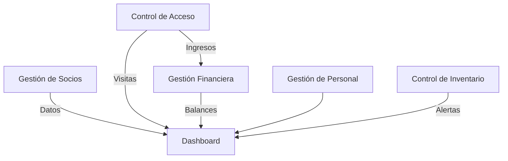

### Gestión de Gimnasio Backend explicado

#### **1. Estructura General del Proyecto**
El proyecto sigue una arquitectura MVC (Modelo-Vista-Controlador) con Spring Boot:
- **Entidades**: Modelos de datos persistentes (`entidades/`)
- **Repositorios**: Capa de acceso a datos (`repository/`)
- **Controladores**: Lógica de negocio y manejo de peticiones HTTP (`*.java`)
- **Vistas**: Plantillas Thymeleaf (`templates/`)
- **Recursos Estáticos**: CSS, JS, imágenes (`static/`)

---

### **2. Análisis de Entidades (Modelos)**

#### **Cliente.java**
```java
@Entity
@Table(name = "cliente")
public class Cliente {
    // Campos clave
    @Id
    @GeneratedValue(strategy = GenerationType.IDENTITY)
    private Long id;
    
    // Restricciones de integridad
    @Column(name = "nombre_completo", nullable = false)
    private String nombreCompleto;
    
    @Column(nullable = false, unique = true) // DNI único
    private String dni;
    
    // Enumerado para género
    @Enumerated(EnumType.STRING)
    private Sexo sexo;
    
    // Auditoría automática
    @Column(name = "fecha_registro", updatable = false)
    private LocalDateTime fechaRegistro = LocalDateTime.now();
}
```
**Funcionamiento**:
- Mapea la tabla `cliente` en MySQL
- `@GeneratedValue`: ID autoincremental
- `unique = true` en DNI: evita duplicados
- `updatable = false`: La fecha de registro no se modifica
- Enumerado `Sexo`: Garantiza valores consistentes (Masculino/Femenino)

#### **Empleado.java**
```java
@Entity
@Table(name = "empleados")
public class Empleado {
    // Enumerados anidados
    public enum Rol { /* ROLES DEL SISTEMA */ }
    public enum Estado { ACTIVO, INACTIVO }
    
    // Formateo de fechas
    @DateTimeFormat(pattern = "yyyy-MM-dd")
    private Date fechaNacimiento;
    
    // Valor por defecto
    private Estado estado = Estado.ACTIVO;
}
```
**Funcionamiento**:
- `@DateTimeFormat`: Parsea automáticamente fechas desde formularios
- Estado predeterminado `ACTIVO`: Nuevos empleados activos por defecto
- Enumerados internos: Centraliza opciones válidas (Rol/Estado)

#### **Entrada.java**
```java
public class Entrada {
    // Auditoría automática en constructor
    public Entrada() {
        this.fecha = LocalDateTime.now();
    }
}
```
**Funcionamiento**:
- Fecha se genera automáticamente al crear instancias
- No necesita setters para `fecha`

#### **Membresia.java**
```java
public class Membresia {
    // Relación muchos-a-uno con Cliente
    @ManyToOne
    @JoinColumn(name = "cliente_id", nullable = false)
    private Cliente cliente;
}
```
**Funcionamiento**:
- `@ManyToOne`: Relación SQL con tabla `cliente`
- `nullable = false`: Obligatorio vincular a cliente

---

### **3. Análisis de Repositorios (Data Access Layer)**

#### **Métodos Clave en Repositorios**
```java
// En EntradaRepository.java
@Query("SELECT SUM(e.monto) FROM Entrada e WHERE DATE(e.fecha) = :fecha")
Double getTotalIngresosPorFecha(@Param("fecha") LocalDate fecha);
```
**Funcionamiento**:
- Consulta JPQL para sumar montos por fecha
- `@Param`: Vincula parámetro del método con la consulta

```java
// En EmpleadoRepository.java
@Query("SELECT e FROM Empleado e WHERE " +
       "(?1 IS NULL OR e.rol = ?1) AND " +
       "(?2 IS NULL OR e.estado = ?2)")
List<Empleado> filtrarPorRolYEstado(Empleado.Rol rol, Empleado.Estado estado);
```
**Funcionamiento**:
- Consulta dinámica con parámetros opcionales
- Filtra combinaciones rol/estado (incluyendo nulls)

---

### **4. Análisis de Controladores (Business Logic)**

#### **Flujo Típico en Controladores**
```java
// En ClienteController.java
@PostMapping("/registrarCliente")
public String registrarCliente(@ModelAttribute Cliente cliente, 
                              RedirectAttributes redirectAttributes) {
    clienteRepository.save(cliente);
    redirectAttributes.addFlashAttribute("mensaje", "Cliente registrado");
    return "redirect:/Registro_Cliente";
}
```
**Funcionamiento**:
1. Recibe objeto `Cliente` desde formulario
2. Persiste en DB con `clienteRepository.save()`
3. Mensaje flash para mostrar confirmación
4. Redirect para evitar reenvío de formulario

#### **Manejo Avanzado en EmpleadoController**
```java
// Validación con BindingResult
if (result.hasErrors()) {
    model.addAttribute("empleados", empleadoRepository.findAll());
    return "empleados"; // Mantiene en formulario con errores
}

// Guardado exitoso
empleadoRepository.save(empleado);
redirectAttributes.addFlashAttribute("successMessage", "Guardado exitoso");
return "redirect:/empleados";
```
**Funcionamiento**:
- `BindingResult`: Captura errores de validación (@Valid)
- Recarga lista de empleados para mantener contexto
- Mensajes flash diferenciados (éxito/error)

#### **Generación de Reportes en EntradaController**
```java
private void generarTxtComprobante(HttpServletResponse response, ...) {
    response.setContentType("text/plain");
    response.setHeader("Content-Disposition", "attachment; filename=comprobante.txt");
    PrintWriter writer = response.getWriter();
    writer.println("COMPROBANTE DE PAGO");
    // ... Formato estructurado
}
```
**Funcionamiento**:
- Modifica `HttpServletResponse` para descarga
- Genera contenido dinámico con `PrintWriter`
- Formato legible para el usuario final

---

### **5. Configuración y Puntos Clave**

#### **AppConfiguracion.java**
```java
@Bean
public ResourceBundleMessageSource messageSource() {
    ResourceBundleMessageSource source = new ResourceBundleMessageSource();
    source.setBasename("messages"); // messages.properties
    source.setDefaultEncoding("UTF-8");
    return source;
}
```
**Funcionamiento**:
- Configura internacionalización (i18n)
- Busca mensajes en `src/resources/messages*.properties`

#### **application.properties**
- **No incluido en el código**, pero se asume configuración para:
  - Conexión a MySQL
  - Configuración de Thymeleaf
  - Opciones de Spring Data JPA

---

### **6. Estado Actual y Funcionalidad**

#### **Módulos Implementados**
| Módulo          | CRUD | Búsquedas | Reportes | Validaciones |
|-----------------|------|-----------|----------|-------------|
| Clientes        | ✅   | ✅ (DNI)  | ❌       | ✅          |
| Empleados       | ✅   | ✅ (Avanz)| ❌       | ✅          |
| Entradas        | ✅   | ✅ (DNI)  | ✅ (TXT) | ✅          |
| Membresías      | ✅   | ❌        | ❌       | ✅          |
| Finanzas        | ✅   | ✅        | ✅ (SUM) | ❌          |
| Inventario      | ✅   | ✅ (Stock)| ❌       | ❌          |

#### **Puntos Fuertes**
1. **Auditoría Automática**: Fechas de registro generadas automáticamente
2. **Validaciones Robustas**:
   - Campos obligatorios (`nullable = false`)
   - Unicidad (DNI único en Cliente/Empleado)
   - Validación de formatos (fechas, números)
3. **Consultas Optimizadas**:
   - JPQL para operaciones complejas (sumatorias, filtros dinámicos)
   - Paginación implícita en listados
4. **Manejo de Errores**:
   - RedirectAttributes para mensajes usuario
   - Try-catch en operaciones críticas

#### **Errores Detectados**
1. **EntradaController**:
   ```java
   // Vulnerabilidad en búsqueda por DNI
   List<Entrada> entradas = entradaRepository.findByDniCliente(dni);
   ```
   - **Problema**: No verifica existencia del cliente
   - **Riesgo**: Permite registrar entradas con DNIs no registrados

2. **MembresiaController**:
   ```java
   if (membresia.getCliente() == null || membresia.getTipo() == null) {
       // ... 
   }
   ```
   - **Problema**: No valida membresías duplicadas
   - **Riesgo**: Un cliente podría tener múltiples membresías activas

3. **DashboardController**:
   ```java
   long renovacionesPendientes = membresiaRepository.countRenovacionesPendientes(LocalDateTime.now());
   ```
   - **Problema**: La lógica de renovación no está implementada
   - **Evidencia**: No hay campo `fecha_expiracion` en `Membresia`

---

### **7. Conclusión del Estado Actual**
El proyecto presenta una **base sólida** con:
- Modelado correcto de entidades principales
- Operaciones CRUD funcionales para todos los módulos
- Validaciones básicas implementadas
- Manejo apropiado de transacciones HTTP (redirects, flash attributes)

**Pendientes Críticos**:
1. Implementar lógica de expiración en membresías
2. Agregar restricción de FK entre `Entrada` y `Cliente`
3. Implementar paginación en listados extensos
4. Añadir manejo de errores global (@ControllerAdvice)

---
---
---

### Procesos de Negocio Identificados en el Código

#### 1. **Gestión de Socios (Clientes y Membresías)**
- **Descripción**: Registro de nuevos clientes y asignación de membresías con diferentes tipos de duración (Diario, Mensual, etc.).
- **Componentes clave**:
  - `ClienteController`: Registro de datos personales, contacto e información médica
  - `MembresiaController`: Asignación de membresías vinculadas a clientes
  - `MembresiaRepository`: Consulta de membresías activas y pendientes de renovación
- **Flujo**:
  1. Registro de cliente (`/Registro_Cliente`)
  2. Asignación de membresía (`/membresia/asignar`)
  3. Seguimiento de estado en dashboard (`/dashboard`)

#### 2. **Control de Acceso (Venta de Entradas)**
- **Descripción**: Venta de entradas diarias con generación de comprobantes físicos.
- **Componentes clave**:
  - `EntradaController`: Procesamiento de pagos y validación de DNI
  - `generarTxtComprobante()`: Generación de tickets con detalles de transacción
  - Historial de entradas por cliente
- **Flujo**:
  1. Validación de DNI y monto
  2. Registro de entrada en base de datos
  3. Emisión de comprobante descargable

#### 3. **Gestión Financiera**
- **Descripción**: Administración de ingresos/gastos y cálculo de balances.
- **Componentes clave**:
  - `MovimientoFinanciero`: Entidad con tipos de transacción (Ingreso/Gasto)
  - `FinanzasController`: Filtrado por fechas/tipos y cálculo de totales
  - `MovimientoFinancieroRepository`: Sumatorias por periodos
- **Flujo**:
  1. Registro de movimiento financiero
  2. Cálculo de balance (ingresos - gastos)
  3. Visualización en reportes (`/finanzas`)

#### 4. **Gestión de Personal**
- **Descripción**: Administración completa de empleados con estados (Activo/Inactivo) y roles.
- **Componentes clave**:
  - `EmpleadoController`: Búsquedas avanzadas (por rol, estado, texto libre)
  - Manejo de estados y validación de datos
  - Filtros combinados en repositorio
- **Flujo**:
  1. Registro con datos personales y rol
  2. Actualización de estado (Activo/Inactivo)
  3. Búsquedas complejas con múltiples criterios

#### 5. **Control de Inventario**
- **Descripción**: Gestión de productos con alertas de stock bajo.
- **Componentes clave**:
  - `InventarioController`: CRUD de productos
  - `ProductoRepository`: Búsqueda de productos con <10 unidades
  - Integración con dashboard para alertas
- **Flujo**:
  1. Registro de productos (nombre, cantidad, precio)
  2. Actualización de inventario
  3. Notificación de stock crítico

#### 6. **Monitoreo Operativo (Dashboard)**
- **Descripción**: Panel de control con indicadores clave del negocio.
- **Componentes clave**:
  - `DashboardController`: Agregación de datos multisistema
  - Indicadores calculados:
    - Ingresos mensuales
    - Socios activos
    - Visitas diarias
    - Renovaciones pendientes
- **Fuentes de datos**:
  - Finanzas, membresías, entradas e inventario

### Relación entre Procesos

