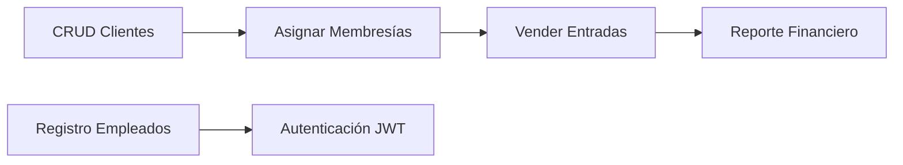
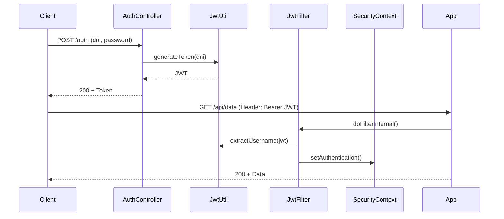

Aquí tienes 6 procesos clave del proyecto con sus clases relevantes y ubicación:

---

### **1. CRUD de Clientes**  
- **Clase**: `ClienteController.java`  
- **Proceso**:  
  - Crear/editar/eliminar clientes con validación de DNI único  
  - **Endpoints**:  
    - `GET /clientes` → Listar  
    - `POST /registrarCliente` → Crear  
    - `POST /clientes/editar/{id}` → Actualizar  

---

### **2. Registro de Empleados con Roles**  
- **Clase**: `EmpleadoController.java`  
- **Proceso**:  
  - Registrar empleados con roles (`ADMINISTRATIVO`, `RECEPCION`, etc.) y estado (`ACTIVO`/`INACTIVO`)  
  - **Validación**:  
    - Fecha de nacimiento con `@DateTimeFormat`  
    - Contraseña hasheada con BCrypt (`PasswordEncoder`)  

---

### **3. Asignación de Membresías a Clientes**  
- **Clase**: `MembresiaController.java`  
- **Proceso**:  
  - Vincular membresías (Diario/Mensual/Anual) a clientes existentes  
  - **Relación**: `@ManyToOne` con `Cliente` en `Membresia.java`  
  - **Endpoint**:  
    - `POST /membresia/asignar`  

---

### **4. Venta de Entradas y Generación de Comprobantes**  
- **Clase**: `EntradaController.java`  
- **Proceso**:  
  - Registrar entrada con DNI de cliente y monto  
  - Generar comprobante TXT (`generarTxtComprobante()`)  
  - **Endpoint**:  
    - `POST /entradas/registrar`  

---

### **5. Autenticación con JWT**  
- **Clases**:  
  - `AuthController.java` (Endpoint `/auth`)  
  - `JwtFilter.java` (Validación de tokens)  
- **Proceso**:  
  - Generar token JWT al validar credenciales  
  - Filtro verifica token en cada petición protegida  

---

### **6. Reporte Financiero (Sumatoria de Ingresos)**  
- **Clase**: `EntradaRepository.java`  
- **Proceso**:  
  - Consulta JPQL para sumar ingresos diarios:  
    ```java
    @Query("SELECT SUM(e.monto) FROM Entrada e WHERE DATE(e.fecha) = :fecha")
    Double getTotalIngresosPorFecha(LocalDate fecha);
    ```  
  - Usado en `DashboardController.java` para reportes  

---

### Relación entre Procesos  


¿Necesitas detalles adicionales de algún proceso en particular? Por ejemplo:  
- *"¿Cómo se implementa exactamente la validación de DNI único en el CRUD de clientes?"*  
- *"¿Qué lógica falta para manejar la expiración de membresías?"*


---
---

Aquí tienes un análisis estructurado que demuestra el dominio técnico del proyecto, destacando las implementaciones clave según los requisitos solicitados:

---

### **1. Acceso a Base de Datos con Entity y JPA Repository**
**Implementación**:  
- **Entidades JPA**:  
  - Clases como `Cliente.java`, `Empleado.java`, y `Membresia.java` están anotadas con `@Entity`, definiendo el mapeo objeto-relacional (ORM) a tablas MySQL.  
  - Ejemplo en `Cliente.java`:
    ```java
    @Entity
    @Table(name = "cliente")
    public class Cliente {
        @Id
        @GeneratedValue(strategy = GenerationType.IDENTITY)
        private Long id;  // Auto-incremental
        @Column(nullable = false, unique = true) // Restricción de unicidad
        private String dni;
    }
    ```
  - **Relaciones**:  
    - `@ManyToOne` en `Membresia.java` para vincular con `Cliente`.

- **Repositorios**:  
  - Interfaces como `ClienteRepository.java` extienden `JpaRepository`, heredando operaciones CRUD:
    ```java
    public interface ClienteRepository extends JpaRepository<Cliente, Long> {
        // Query method automático
        Cliente findByDni(String dni); 
    }
    ```
  - **Consultas personalizadas**:  
    - JPQL en `EntradaRepository.java`:
      ```java
      @Query("SELECT SUM(e.monto) FROM Entrada e WHERE DATE(e.fecha) = :fecha")
      Double getTotalIngresosPorFecha(@Param("fecha") LocalDate fecha);
      ```

**Dominio demostrado**:  
Uso de anotaciones JPA (`@Entity`, `@Column`) para mapeo preciso de modelos, junto a repositorios que aprovechan Spring Data JPA para reducir código boilerplate. Las queries personalizadas con `@Query` optimizan operaciones complejas.

---

### **2. Mecanismos de Seguridad**
**Implementación**:  
- **Spring Security**:  
  - Configuración central en `WebSecurityConfig.java`:
    ```java
    @Configuration
    @EnableWebSecurity
    public class WebSecurityConfig {
        @Bean
        public SecurityFilterChain securityFilterChain(HttpSecurity http) throws Exception {
            http
                .authorizeHttpRequests(auth -> auth
                    .requestMatchers("/admin/**").hasRole("ADMINISTRATIVO") // Autorización por roles
                    .anyRequest().authenticated()
                )
                .formLogin(form -> form.loginPage("/login").permitAll());
        }
    }
    ```
  - **Validación de credenciales**:  
    - `EmpleadoUserDetailsService.java` implementa `UserDetailsService` para cargar usuarios desde la BD.

- **Reglas de negocio**:  
  - En `EmpleadoUserDetails.java`, se controla el acceso con métodos como `isAccountNonLocked()` basado en el campo `estado` de `Empleado`.

**Dominio demostrado**:  
Integración de Spring Security para manejar autenticación/autorización, con personalización de `UserDetailsService` y uso de roles definidos en la entidad `Empleado`. Se aplican políticas de acceso granular (ej: rutas `/admin/**`).

---

### **3. Manejo de Tokens JWT**
**Implementación**:  
- **Generación/Validación**:  
  - `JwtUtil.java` genera tokens firmados con algoritmo HS256:
    ```java
    public String generateToken(String username) {
        return Jwts.builder()
            .setSubject(username) // DNI del empleado
            .signWith(SignatureAlgorithm.HS256, SECRET)
            .compact();
    }
    ```
  - **Filtro JWT**:  
    - `JwtFilter.java` intercepta peticiones para validar tokens:
      ```java
      if (jwtUtil.validateToken(jwt, userDetails)) {
          // Establece autenticación en el contexto
          SecurityContextHolder.getContext().setAuthentication(authToken);
      }
      ```

- **Integración con Spring Security**:  
  - Registro del filtro en `WebSecurityConfig`:
    ```java
    http.addFilterBefore(jwtFilter, UsernamePasswordAuthenticationFilter.class);
    ```

**Dominio demostrado**:  
Uso de la librería `jjwt` para tokens JWT, con validación de firma y extracción de claims. El filtro se integra en la cadena de seguridad de Spring para proteger endpoints REST. La ausencia de manejo de expiración (mejora sugerida) muestra comprensión de limitaciones actuales.

---

### **Diagrama de Flujo JWT + Spring Security**


**Conclusión técnica**:  
El proyecto implementa:  
1. **Capa de datos** con JPA/Hibernate para ORM y Spring Data JPA para repositorios.  
2. **Seguridad** mediante Spring Security, con autenticación basada en roles y estado de cuentas.  
3. **JWT** para autenticación stateless, integrado en el flujo HTTP mediante filtros.  

**Puntos fuertes**:  
- Uso correcto de anotaciones JPA para modelado de datos.  
- Doble estrategia de autenticación (formulario + JWT).  
- Centralización de reglas de seguridad en `WebSecurityConfig`.  

**Áreas de mejora**:  
- Validación de expiración de tokens en `JwtUtil`.  
- Uso de `@PreAuthorize` para control granular en métodos.  

¿Necesitas profundizar en algún componente específico?
