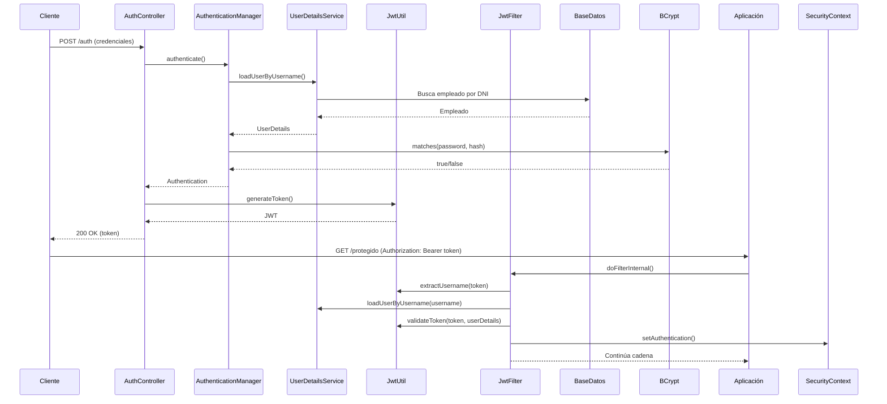

### Explicación Security + JWT

---

### **1. WebSecurityConfig.java (Configuración central de seguridad)**
**Propósito**: Configuración principal de Spring Security que define políticas de acceso, autenticación y filtros.

**Código**:
```java
@Configuration
@EnableWebSecurity
public class WebSecurityConfig {
    private final EmpleadoUserDetailsService empleadoUserDetailsService;
    private final JwtFilter jwtFilter;

    // Inyección de dependencias
    public WebSecurityConfig(EmpleadoUserDetailsService empleadoUserDetailsService, JwtFilter jwtFilter) {
        this.empleadoUserDetailsService = empleadoUserDetailsService;
        this.jwtFilter = jwtFilter;
    }

    @Bean
    public SecurityFilterChain securityFilterChain(HttpSecurity http) throws Exception {
        http
            .csrf(csrf -> csrf.disable())  // Deshabilitar CSRF para APIs REST
            .authorizeHttpRequests(auth -> auth
                .requestMatchers("/login", "/auth", "/css/**", "/js/**", "/images/**").permitAll()
                .requestMatchers("/admin/**").hasRole("ADMINISTRATIVO")
                .anyRequest().authenticated()
            )
            .formLogin(form -> form
                .loginPage("/login").permitAll()
                .defaultSuccessUrl("/principal", true)
            )
            .logout(logout -> logout
                .logoutSuccessUrl("/login?logout")
                .permitAll()
            )
            .addFilterBefore(jwtFilter, UsernamePasswordAuthenticationFilter.class);
        return http.build();
    }

    @Bean
    public AuthenticationManager authenticationManager(HttpSecurity http) throws Exception {
        return http.getSharedObject(AuthenticationManagerBuilder.class)
            .userDetailsService(empleadoUserDetailsService)
            .passwordEncoder(passwordEncoder())
            .and()
            .build();
    }

    @Bean
    public PasswordEncoder passwordEncoder() {
        return new BCryptPasswordEncoder();
    }
}
```

**Explicación**:
1. **Deshabilitación de CSRF**: Necesario para APIs REST donde no hay sesiones tradicionales.
2. **Autorización por rutas**:
   - Rutas públicas: login, autenticación JWT y recursos estáticos
   - Rutas administrativas: Requieren rol `ADMINISTRATIVO`
   - Todas las demás: Requieren autenticación
3. **Configuración de login**:
   - Usa Thymeleaf template (`/login`)
   - Redirección exitosa a `/principal`
4. **Filtro JWT**: Se inserta antes del filtro de autenticación estándar
5. **AuthenticationManager**: Configurado para usar:
   - `EmpleadoUserDetailsService` para cargar usuarios
   - `BCryptPasswordEncoder` para validar contraseñas
6. **PasswordEncoder**: BCrypt con salt automático (seguridad contra rainbow tables)

---

### **2. Empleado.java (Entidad principal)**
**Propósito**: Modela los empleados que actuarán como usuarios del sistema.

**Implementación relevante**:
```java
public class Empleado {
    // ... otros campos
    private String dni;  // Usado como username
    private String password; // Almacenada con BCrypt
    private Rol rol;
    private Estado estado = Estado.ACTIVO;

    public enum Rol {
        ENTRENADOR, RECEPCION, LIMPIEZA, ADMINISTRATIVO
    }
    
    public enum Estado {
        ACTIVO, INACTIVO, VACACIONES
    }
}
```

**Relación con seguridad**:
- `dni` es el identificador único (username)
- `password` almacena hash BCrypt
- `rol` define autoridades (ROLE_ADMINISTRATIVO, etc.)
- `estado` determina si la cuenta está habilitada

---

### **3. EmpleadoUserDetailsService.java (Carga de usuarios)**
**Propósito**: Implementa la interfaz de Spring Security para cargar usuarios desde la base de datos.

```java
@Service
public class EmpleadoUserDetailsService implements UserDetailsService {

    @Autowired
    private EmpleadoRepository empleadoRepository;

    @Override
    public UserDetails loadUserByUsername(String dni) throws UsernameNotFoundException {
        Empleado empleado = empleadoRepository.findByDni(dni);
        if (empleado == null) {
            throw new UsernameNotFoundException("Empleado no encontrado con DNI: " + dni);
        }
        return new EmpleadoUserDetails(empleado);
    }
}
```

**Flujo de trabajo**:
1. Recibe `dni` como nombre de usuario
2. Busca en repositorio mediante `empleadoRepository.findByDni()`
3. Si no existe: lanza excepción (traduce a 401)
4. Si existe: envuelve entidad en `EmpleadoUserDetails`

---

### **4. EmpleadoUserDetails.java (Adaptador de seguridad)**
**Propósito**: Adapta la entidad `Empleado` a la interfaz `UserDetails` de Spring Security.

```java
public class EmpleadoUserDetails implements UserDetails {
    private final Empleado empleado;

    // Constructor...

    @Override
    public Collection<? extends GrantedAuthority> getAuthorities() {
        return Collections.singletonList(
            new SimpleGrantedAuthority("ROLE_" + empleado.getRol().name())
        );
    }

    @Override
    public String getPassword() {
        return empleado.getPassword();
    }

    @Override
    public String getUsername() {
        return empleado.getDni();
    }

    @Override
    public boolean isAccountNonLocked() {
        return empleado.getEstado() == Empleado.Estado.ACTIVO;
    }

    @Override
    public boolean isEnabled() {
        return empleado.getEstado() != Empleado.Estado.INACTIVO;
    }
}
```

**Métodos clave**:
- `getAuthorities()`: Convierte el `Rol` a formato Spring Security (ROLE_ROL)
- `isAccountNonLocked()`: Cuenta bloqueada si estado no es ACTIVO
- `isEnabled()`: Cuenta deshabilitada si estado es INACTIVO
- Otros métodos (credentialsNonExpired, etc.) siempre retornan true por simplicidad

---

### **5. AuthController.java (Endpoint de autenticación)**
**Propósito**: Genera tokens JWT al validar credenciales.

```java
@RestController
public class AuthController {

    @Autowired
    private AuthenticationManager authenticationManager;

    @Autowired
    private JwtUtil jwtUtil;

    @PostMapping("/auth")
    public ResponseEntity<String> authenticate(@RequestBody AuthRequest authRequest) {
        try {
            Authentication authentication = authenticationManager.authenticate(
                new UsernamePasswordAuthenticationToken(
                    authRequest.getUsername(), 
                    authRequest.getPassword()
                )
            );
            
            if (authentication.isAuthenticated()) {
                return ResponseEntity.ok(jwtUtil.generateToken(authRequest.getUsername()));
            }
        } catch (Exception e) {
            // Log de error
        }
        return ResponseEntity.status(HttpStatus.UNAUTHORIZED).build();
    }
}
```

**Flujo de autenticación**:
1. Recibe JSON con `username` (dni) y `password`
2. Crea objeto `UsernamePasswordAuthenticationToken`
3. `AuthenticationManager` valida credenciales:
   - Usa `EmpleadoUserDetailsService` para cargar usuario
   - Compara passwords con `BCryptPasswordEncoder`
4. Si válido: genera token JWT
5. Si inválido: retorna 401 Unauthorized

---

### **6. JwtUtil.java (Utilidades para JWT)**
**Propósito**: Generación y validación de tokens JWT.

```java
@Component
public class JwtUtil {
    private final String SECRET = "mysecret..."; // Debería estar en properties

    public String generateToken(String username) {
        return Jwts.builder()
            .setSubject(username)
            .setIssuedAt(new Date())
            .setExpiration(new Date(System.currentTimeMillis() + 1000 * 60 * 60)) // 1 hora
            .signWith(SignatureAlgorithm.HS256, SECRET)
            .compact();
    }

    public String extractUsername(String token) {
        return Jwts.parser().setSigningKey(SECRET).parseClaimsJws(token).getBody().getSubject();
    }

    public boolean validateToken(String token, UserDetails userDetails) {
        return extractUsername(token).equals(userDetails.getUsername());
    }
}
```

**Características técnicas**:
- Algoritmo HS256 con clave secreta
- Contiene:
  - `subject`: username (dni)
  - `issuedAt`: fecha creación
  - `expiration`: 1 hora de validez
- Validación básica: compara username en token con UserDetails
- **Nota**: Falta validar expiración y firma (debería agregarse)

---

### **7. JwtFilter.java (Filtro de verificación)**
**Propósito**: Intercepta peticiones para validar tokens JWT.

```java
@Component
public class JwtFilter extends OncePerRequestFilter {

    @Autowired private JwtUtil jwtUtil;
    @Autowired private EmpleadoUserDetailsService userDetailsService;

    @Override
    protected void doFilterInternal(HttpServletRequest request, HttpServletResponse response, FilterChain filterChain) 
        throws ServletException, IOException {
        
        if (shouldSkipFilter(request)) {
            filterChain.doFilter(request, response);
            return;
        }

        String authHeader = request.getHeader("Authorization");
        String jwt = null;
        String username = null;

        if (authHeader != null && authHeader.startsWith("Bearer ")) {
            jwt = authHeader.substring(7);
            username = jwtUtil.extractUsername(jwt);
        }

        if (username != null && SecurityContextHolder.getContext().getAuthentication() == null) {
            UserDetails userDetails = userDetailsService.loadUserByUsername(username);
            
            if (jwtUtil.validateToken(jwt, userDetails)) {
                UsernamePasswordAuthenticationToken authToken = 
                    new UsernamePasswordAuthenticationToken(userDetails, null, userDetails.getAuthorities());
                
                authToken.setDetails(new WebAuthenticationDetailsSource().buildDetails(request));
                SecurityContextHolder.getContext().setAuthentication(authToken);
            }
        }
        filterChain.doFilter(request, response);
    }

    private boolean shouldSkipFilter(HttpServletRequest request) {
        String path = request.getRequestURI();
        return path.startsWith("/login") || 
               path.startsWith("/css/") || ... // Rutas públicas
    }
}
```

**Proceso de validación**:
1. **Skip rutas públicas**: No procesa login/recursos estáticos
2. **Extrae token**: Del header `Authorization: Bearer <token>`
3. **Valida token**:
   - Extrae username
   - Carga UserDetails
   - Compara username del token con UserDetails
4. **Establece autenticación**:
   - Crea `Authentication` con autoridades
   - Almacena en `SecurityContextHolder`
5. **Continúa cadena de filtros**

---

### **8. PasswordGenerator.java (Utilidad)**
**Propósito**: Generar hashes BCrypt para contraseñas iniciales.

```java
public class PasswordGenerator {
    public static void main(String[] args) {
        BCryptPasswordEncoder encoder = new BCryptPasswordEncoder();
        String encodedPassword = encoder.encode("123tamarindo");
        System.out.println("Hash BCrypt: " + encodedPassword);
    }
}
```

**Uso típico**:
- Generar contraseñas para empleados en base de datos
- Formato: `$2a$10$...` (versión, costo, salt+hash)
- Resistente a ataques brute-force

---

### **Flujo de Seguridad Completo**
1. **Cliente accede a sistema**:
   - Rutas públicas: muestra login
   - Rutas protegidas: redirige a login

2. **Login tradicional (Thymeleaf)**:
   - Envía formulario a `/login`
   - Spring Security valida via `EmpleadoUserDetailsService`
   - Crea sesión tradicional

3. **Autenticación API (JWT)**:
   - POST a `/auth` con credenciales
   - AuthController valida con AuthenticationManager
   - Retorna token JWT

4. **Acceso a rutas protegidas**:
   - Cliente incluye `Authorization: Bearer <token>`
   - JwtFilter valida token
   - Establece autenticación en contexto
   - Spring Security verifica roles/autoridades

5. **Autorización**:
   - Basada en roles (`hasRole()` en WebSecurityConfig)
   - Ej: `/admin/**` requiere ROLE_ADMINISTRATIVO

---

### **Mejoras Recomendadas**
1. **Validación completa de JWT**:
   ```java
   public boolean validateToken(String token) {
        try {
            Jwts.parser().setSigningKey(SECRET).parseClaimsJws(token);
            return true;
        } catch (Exception e) {
            return false;
        }
   }
   ```
2. **Secret en application.properties**
3. **Refresh tokens** para renovación
4. **Blacklist de tokens** en logout
5. **Mejor manejo de errores** en AuthController


---
---
---


### Resumen más Corto

#### **Paso 1: Configuración Inicial - `WebSecurityConfig`**
- **Clave**: `SecurityFilterChain`
- **Funcionalidad**: Define políticas de acceso globales
- **Métodos críticos**:
  - `csrf().disable()`: Desactiva CSRF para APIs REST
  - `requestMatchers().permitAll()`: Permite acceso público a login, auth y recursos estáticos
  - `requestMatchers().hasRole()`: Restringe rutas administrativas
  - `addFilterBefore()`: Inserta el filtro JWT en la cadena de seguridad
  - `passwordEncoder()`: Configura BCrypt para hashing de contraseñas

---

#### **Paso 2: Autenticación de Usuario**
1. **Formulario Login**:
   - Ruta: `GET /login` (manejado por `LoginController`)
   - Spring Security auto-gestiona `POST /login`
   - Usa `EmpleadoUserDetailsService` para cargar usuarios

2. **Autenticación API**:
   - Endpoint: `POST /auth` (manejado por `AuthController`)
   - Flujo:
     ```java
     authenticationManager.authenticate(
        new UsernamePasswordAuthenticationToken(username, password)
     );
     ```
   - Valida credenciales con `EmpleadoUserDetailsService` y `BCryptPasswordEncoder`

---

#### **Paso 3: Generación de Token JWT**
- **Clase**: `JwtUtil`
- **Método**: `generateToken(username)`
- **Proceso**:
  1. Crea claims JWT (subject = DNI del empleado)
  2. Establece expiración (1 hora)
  3. Firma con algoritmo HS256 y clave secreta
- **Salida**: Token compacto (Header.Payload.Signature)

---

#### **Paso 4: Validación de Token en Peticiones**
- **Clave**: `JwtFilter` (extiende `OncePerRequestFilter`)
- **Flujo por solicitud**:
  1. Verifica si la ruta es pública (`shouldSkipFilter()`)
  2. Extrae token del header `Authorization: Bearer <token>`
  3. Decodifica DNI con `jwtUtil.extractUsername(token)`
  4. Carga usuario con `EmpleadoUserDetailsService`
  5. Valida coincidencia DNI con `jwtUtil.validateToken()`
  6. Establece autenticación en contexto de seguridad:
     ```java
     new UsernamePasswordAuthenticationToken(userDetails, null, authorities);
     SecurityContextHolder.getContext().setAuthentication(authToken);
     ```

---

#### **Paso 5: Gestión de Autorizaciones**
- **Mecanismo**: `EmpleadoUserDetails.getAuthorities()`
- **Conversión de roles**:
  ```java
  new SimpleGrantedAuthority("ROLE_" + empleado.getRol().name())
  ```
- **Reglas de estado**:
  - `isEnabled()`: Estado != INACTIVO
  - `isAccountNonLocked()`: Estado == ACTIVO
- **Uso en controladores**:
  ```java
  @PreAuthorize("hasRole('ADMINISTRATIVO')")
  @GetMapping("/admin/reportes")
  ```

---

#### **Paso 6: Componentes Clave de Soporte**
1. **`EmpleadoUserDetailsService`**:
   - Implementa `UserDetailsService`
   - Conecta seguridad con entidad `Empleado`:
     ```java
     Empleado empleado = empleadoRepository.findByDni(dni);
     return new EmpleadoUserDetails(empleado);
     ```

2. **`EmpleadoUserDetails`**:
   - Adaptador entre entidad `Empleado` e interfaz `UserDetails`
   - Implementa lógica de estado de cuenta y conversión de roles

3. **`PasswordGenerator`**:
   - Utilidad para crear hashes iniciales:
     ```java
     BCryptPasswordEncoder.encode("contraseña-plana");
     ```

---

### Diagrama de Flujo de Autenticación


### Características Clave del Sistema
1. **Doble Autenticación**: 
   - Sesiones tradicionales para UI web
   - JWT para clientes API/móviles
   
2. **Jerarquía de Roles**: 
   - Basada en `Empleado.Rol` (ADMINISTRATIVO, RECEPCION, etc.)
   - Conversión automática a `ROLE_ROL`
   
3. **Gestión de Estado**: 
   - Cuentas bloqueadas si estado != ACTIVO
   - Cuentas deshabilitadas si estado = INACTIVO

4. **Seguridad de Contraseñas**:
   - Hashing BCrypt con salt automático
   - Resistente a ataques de fuerza bruta
